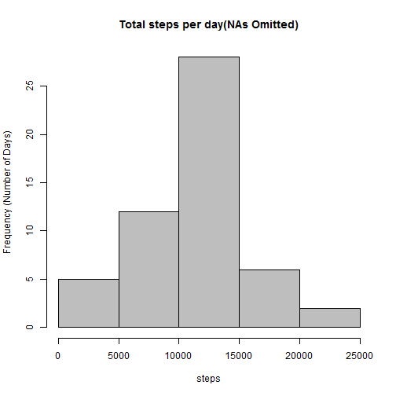
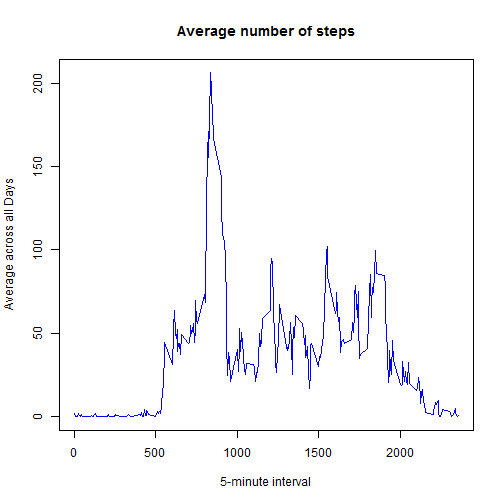
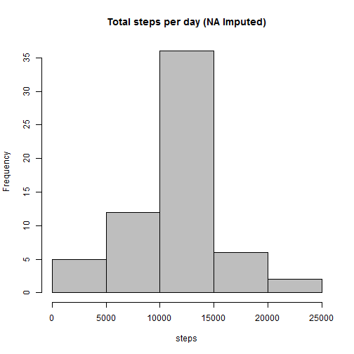
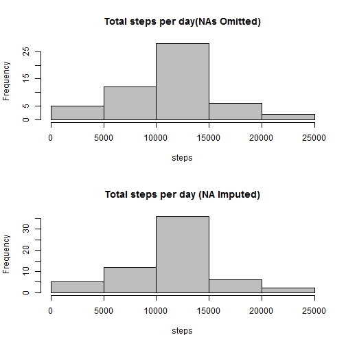
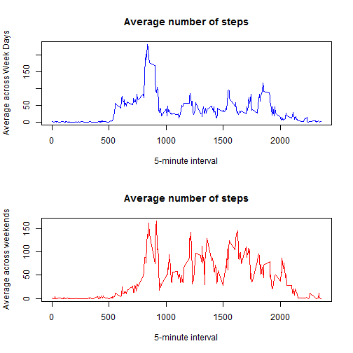

## Loading and preprocessing the data
###1. Load the data (i.e. read.csv())

```r
#setwd("C:/Coursera/R/ReproducibleResearch") - this was commented because of knit2html does not like the setwd in code chunks
#setwd is done before running knit2html command 
###Load the data using read.csv
activity <- read.csv("activity_monitor_data/activity.csv")
```


###2. Process/transform the data (if necessary) into a format suitable for your analysis

```r
### Remove NAs from the Data Frame
activity_no_na <- na.omit(activity)
```


## What is mean total number of steps taken per day?
### 1. Calculate the total number of steps taken per day
### 2. Make a histogram of the total number of steps taken each day
### 3. Calculate and report the mean and median of the total number of steps taken per day

```r
total_steps_per_day <- aggregate(activity_no_na[, 'steps'], by=list(activity_no_na$date), FUN=sum)
colnames(total_steps_per_day) = c("day","total_steps")

hist(total_steps_per_day$total_steps, main = "Total steps per day(NAs Omitted)", xlab = "steps",ylab="Frequency (Number of Days)",col="grey")
```

 

```r
###dev.off()

### compute the mean and median
print("The mean after removing NAs:")
```

```
## [1] "The mean after removing NAs:"
```

```r
mean(total_steps_per_day$total_steps)
```

```
## [1] 10766.19
```

```r
print("The median after removing NAs:")
```

```
## [1] "The median after removing NAs:"
```

```r
median(total_steps_per_day$total_steps)
```

```
## [1] 10765
```

## What is the average daily activity pattern?
### 1. Make a time series plot (i.e. type = "l") of the 5-minute interval (x-axis) and the average number of steps taken, averaged across all days (y-axis)
### 2. Which 5-minute interval, on average across all the days in the dataset, contains the maximum number of steps?

```r
avg_interval_activity <- aggregate(activity_no_na[,'steps'], by=list(activity_no_na$interval), FUN=mean)

### Now plot it
plot(avg_interval_activity$x~avg_interval_activity$Group.1,type="l",main = "Average number of steps",
     ylab = "Average across all Days", xlab = "5-minute interval",col = "blue")
```

 

```r
# 2- which five minute interval contains the maximum number of steps?
average_steps_per_interval <- aggregate(activity_no_na[, 'steps'], by=list(activity_no_na$interval), FUN=mean)
colnames(average_steps_per_interval) = c("interval","average_steps")
print("The five minute interval that contains the maximum number of steps:")
```

```
## [1] "The five minute interval that contains the maximum number of steps:"
```

```r
average_steps_per_interval[which.max(average_steps_per_interval$average_steps),]$interval
```

```
## [1] 835
```

## Imputing missing values
### 1. Calculate and report the total number of missing values in the dataset (i.e. the total number of rows with NAs)
### 2. Devise a strategy for filling in all of the missing values in the dataset. The strategy does not need to be sophisticated. For example, you could use the mean/median for that day, or the mean for that 5-minute interval, etc.
### 3. Create a new dataset that is equal to the original dataset but with the missing data filled in.
### 4. Make a histogram of the total number of steps taken each day and Calculate and report the mean and median total number of steps taken per day.

#### the missing or NA values are imputed by the average value of that particular interval
#### computed across all days - so there are 288 different intervals in the data set


```r
## 1- number of NA values
num_activity_na <- sum(is.na(activity))
num_activity_na
```

```
## [1] 2304
```

```r
filled_activity <- activity

# this can use the cached value of average_steps_per_interval computed before
average_steps_per_interval <- aggregate(filled_activity[, 'steps'], by=list(filled_activity$interval), FUN=mean,na.rm=TRUE)
colnames(average_steps_per_interval) <- c("interval","mean_steps")

for (i in 1:nrow(filled_activity)) {
        if (is.na(filled_activity[i, ]$steps)) {
                # pull the interval
                inter <- filled_activity[i,]$interval
                
                # get the average steps for that interval
                m_steps <- average_steps_per_interval[which(average_steps_per_interval$interval == inter),]$mean_steps
                
                # now replace NA with the average steps for that interval
                filled_activity[i, ]$steps <- m_steps
                
                # the above 3 steps can be done in one step - but to make the code more readable 
                # new_activity[i, ]$steps <- average_steps_per_interval[which(average_steps_per_interval$interval == new_activity[i,]$interval),]$mean_steps
        }
}

total_steps_per_day_fill <- aggregate(filled_activity[, 'steps'], by=list(filled_activity$date), FUN=sum)
colnames(total_steps_per_day_fill) = c("date","total_steps")
hist(total_steps_per_day_fill$total_steps, main = "Total steps per day (NA Imputed)", xlab = "steps",col="grey")
```

 

### What is the impact of imputing missing data on the estimates of the total daily number of steps?

```r
par(mfrow = c(2, 1)) 
hist(total_steps_per_day$total_steps, main = "Total steps per day(NAs Omitted)", xlab = "steps",col="grey")
hist(total_steps_per_day_fill$total_steps, main = "Total steps per day (NA Imputed)", xlab = "steps",col="grey")
```

 

### mean and median with NAs Omitted

```r
mean(total_steps_per_day$total_steps)
```

```
## [1] 10766.19
```

```r
median(total_steps_per_day$total_steps)
```

```
## [1] 10765
```
### mean and median with NAs imputed with average of the corresponding interval

```r
mean(total_steps_per_day_fill$total_steps)
```

```
## [1] 10766.19
```

```r
median(total_steps_per_day_fill$total_steps)
```

```
## [1] 10766.19
```

## Are there differences in activity patterns between weekdays and weekends?
### 1. Create a new factor variable in the dataset with two levels - "weekday" and "weekend" indicating whether a given date is a weekday or weekend day.
### 2. Make a panel plot containing a time series plot (i.e. type = "l") of the 5-minute interval (x-axis) and the average number of steps taken, averaged across all weekday days or weekend days (y-axis).


```r
w_day <- vector()

for (i in 1:nrow(filled_activity)) {
        if (weekdays(as.Date(filled_activity[i,]$date)) == "Saturday") {
                w_day[i] <- "Weekend"
        } else if (weekdays(as.Date(filled_activity[i,]$date)) == "Sunday") {
                w_day[i] <- "Weekend"
        } else {
                w_day[i] <- "Weekday"
        }
}

filled_activity$w_day <- w_day

# calculate the average steps for weekdays and weekends separately
# then draw the plots for both using mfrow

activity_weekday <- filled_activity[which(filled_activity$w_day == "Weekday"),]
activity_weekend <- filled_activity[which(filled_activity$w_day == "Weekend"),]

activity_weekday_interval_ts_a <- aggregate(activity_weekday[,'steps'], by=list(activity_weekday$interval), FUN=mean)
activity_weekend_interval_ts_a <- aggregate(activity_weekend[,'steps'], by=list(activity_weekend$interval), FUN=mean)

par(mfrow = c(2, 1)) 
plot(activity_weekday_interval_ts_a$x~activity_weekend_interval_ts_a$Group.1,type="l",main = "Average number of steps",
     xlab = "5-minute interval",  ylab = "Average across Week Days",col = "blue")
     
plot(activity_weekend_interval_ts_a$x~activity_weekend_interval_ts_a$Group.1,type="l",main = "Average number of steps", 
     xlab = "5-minute interval", ylab = "Average across weekends",col = "red")
```

 

